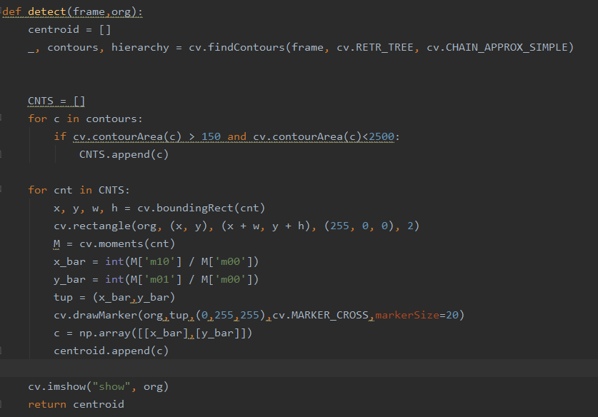
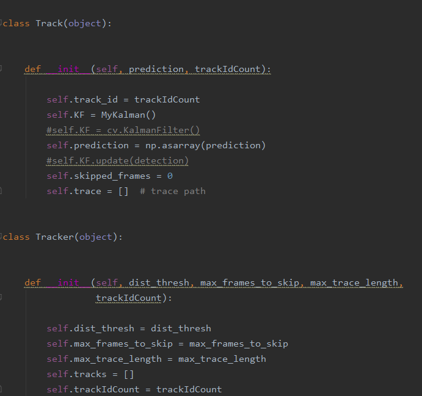
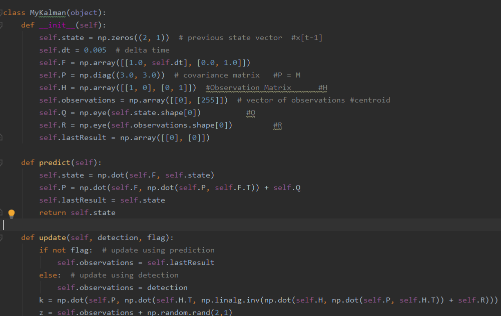

# Multi-object-tracking-using-OpenCV

<html>
<body data-gr-c-s-loaded="true">
Shoumik Majumdar  
Collaborator : Tushar Sharma 

<h2> Problem Definition </h2>

The goal of this assignment is to learn more about the practical issues
 that arise when designing a tracking system. More specifically, we are going to track animals in
 video sequences, i.e., identifying the same animal from frame to frame. 
 

 To achive this goal, we first need a model to predict the position of an object on next frame based on its
 positions on previous frames. We could use filters such as alpha-beta filter, kalman filter to do the trick. 
 For each predicted position, we need to associate it with a real detected object in the next frame using some
 data association algorithm. 
 

 Difficulties include bad object detections, objects occluding with each other, etc.

<h2> Method and Implementation </h2>
<ol>
<li>The First step is to find the centroids of each detected objects in each and every frames. We will be tracking centroids of the objects in this Assignment</li>
<li>For this process, we did a bit of preprocessing which included background substraction and morphology(erosion and dilation) </li>
<li>We then created a tracking object to store all the data related to the objects
under tracking, including its position, Kalman filter parameters and trace.</li>
<li> We then initiated the Kalman filter to predict the position of each tracking objects in the next frame.</li>
<li> <b>Data-Association:</b> We Used hungarian method to do bipartite matching and associated the detected object to it's appropriate track.</li>
Objective of Hungarian method is to minimize the total cost rather than element wise cost while doing bipartite matching.
<li> Updated the filter parameters as well as the tracking objects list. This includes adding new detected objects
into the tracking object list if no exsiting tracking object is associated with it, and removing objects from the list
if we lose track of them. </li>
<li> Repeat such steps all the way through the last frame. </li>
</ol>

 
 
 

<h2>Experiments</h2>

For the "bat" and "cell" dataset, we have used our own detection pipeline. To pre processe the data we applied background substraction,morphology(erosion and dilation).
To calculate the centroids of the bats and cells we are using moments. In subsequent frame we are tracking the centroids calculated in previous frames.

With these centroids as INPUT, the algorithm can track the objects and draw the tracking results dynamicly in real-time.   

<h2> Results</h2>

The tracking results for both dataset are shown below.

<iframe width="560" height="315" src="https://www.youtube.com/embed/G09bWMv4SpA" frameborder="0" allow="accelerometer; autoplay; encrypted-media; gyroscope; picture-in-picture" allowfullscreen></iframe>

<iframe width="560" height="315" src="https://www.youtube.com/embed/lXuIId4IkRc" frameborder="0" allow="accelerometer; autoplay; encrypted-media; gyroscope; picture-in-picture" allowfullscreen></iframe>

<h2> Discussion </h2>

 

<ul>
<li>As shown in the videos, the tracking results is good when the detection of the objects is correct and when the object 
is not occluded. 
 </li>
 For the Cell dataset, the objects do not occlude a lot and maintain some small distance from other objects. The tracking using the Hungarian algorithm in this case does a good job.
However, for the bat dataset, there is a lot of occlusion. This causes tracks to "jump" from one object to another when occusion occurs. THis is because Hungarian Algorithm minimizes the cost of the system rather than individual costs.
For the Bat dataset, Greedy Algorithm might prove to work better provided the Kalman Filter predictions and detections are fairly good.
 </li>
<li>A distance threshold is set in the tracking function so that it won't match the predicted point
with a point far away even though their is no nearby match, in this case, the object will be removed from the tracking object list.</li>
<li>For future work, we need to come up with a way to match occluded objects with their original track when they reappear, possibly using Greedy Algorithm. </li> 
</ul>

<h2> Conclusions </h2>

The implemented kalman filter predicts the position of the objects fairly well.As a whole, this track can work well provided that the 
detections are accurate and occlusion is limited.

<h2> Credits and Bibliography </h2>

<a href="https://towardsdatascience.com/kalman-filter-an-algorithm-for-making-sense-from-the-insights-of-various-sensors-fused-together-ddf67597f35e">Reference 1</a> 
<a href="http://www.bzarg.com/p/how-a-kalman-filter-works-in-pictures/">Reference 2</a> 
<a href="https://towardsdatascience.com/kalman-filter-intuition-and-discrete-case-derivation-2188f789ec3a">Reference 3</a> 
<a href="https://github.com/srianant/kalman_filter_multi_object_tracking"> Reference 4</a>

</body></html>

The goal of this project is to track multiple object using recursive bayesial filtering and data association methods. In this case, I use Kalman Filter for position predictions
and the Hungarian algorithm for data association.

The script for tracking bats is bats.py
The script for tracking cell divisions is cells.py

The data can be found in the BatImages and Cell Images folders
